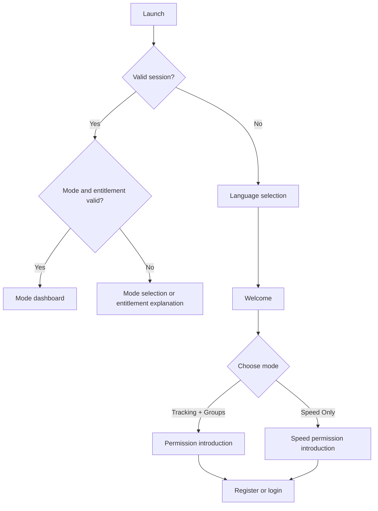
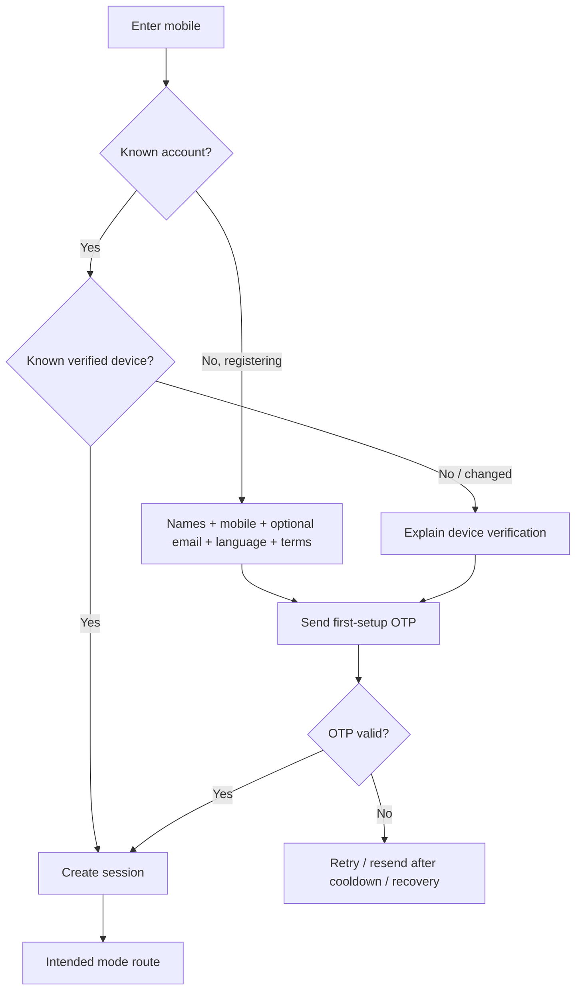
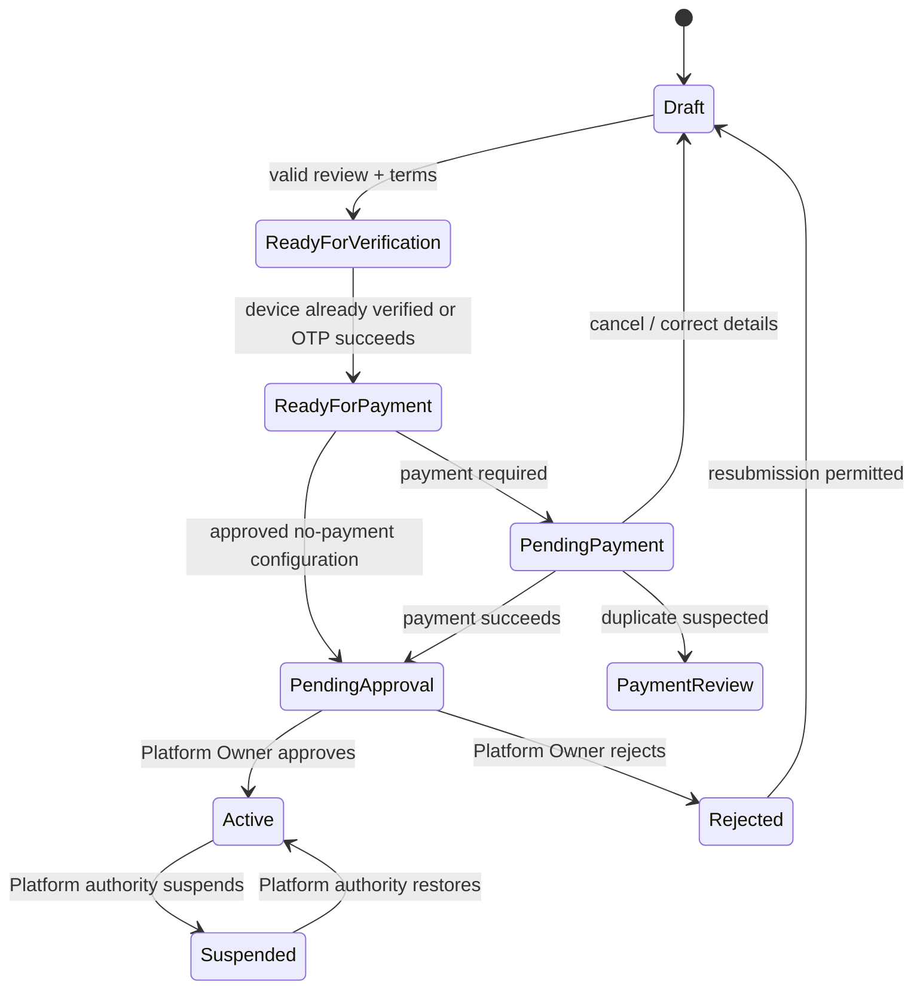
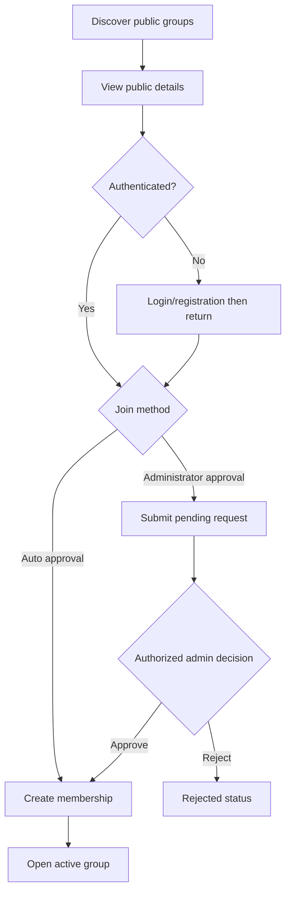
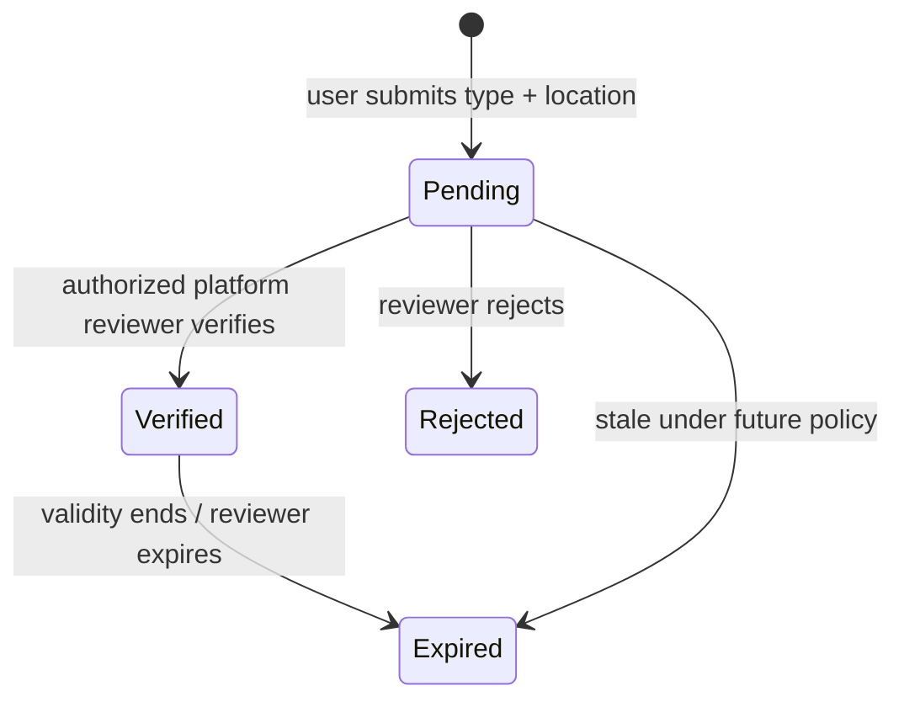

# User Flows and Role-Based Access Control

This document is the source of truth for end-to-end flow behavior, role definitions, permissions, and access-denial outcomes. Product requirements remain in `01_PRD.md`; route names and screen details remain in `03_WIREFRAME.md`.

## Section A — User flows

### Required-flow coverage index

| # | Required flow | Detailed section |
|---:|---|---|
| 1–3 | First launch, language selection, mode selection | A1 |
| 4–8 | Registration, login, OTP, device-change OTP, account recovery (the passwordless replacement for forgot password) | A2 |
| 9 | Location permission | A3 |
| 10–14 | Create group, group payment, owner approval, owner rejection, group resubmission | A4; payment and owner decision details also A16–A17 |
| 15–16 | Public discovery and public join | A5 |
| 17–19 | Private invite link, QR invitation, WhatsApp share | A6 |
| 20–21 | Group member invitation and join-request approval | A7 |
| 22–23 | Administrator assignment and permission configuration | A8 |
| 24–25 | Tracking and visibility configuration | A9 |
| 26–27 | Live map and member details | A10 |
| 28 | Navigation | A11 |
| 29 | Speed warning | A12 |
| 30–31 | Road alert reporting and verification | A13 |
| 32 | SOS | A14 |
| 33–34 | Trip completion and reports | A15 |
| 35 | Subscription | A16 |
| 36–37 | Speed-only onboarding and dashboard | A12 plus A1–A2 |
| 38 | Platform-owner approval workflow | A17 |

### A1. First launch, language, and mode selection

1. Bootstrap reads only valid local preferences/session projection.
2. A first-time user chooses a language; exact languages and RTL remain open.
3. Welcome explains the two modes without implying that mocks are live.
4. Tracking mode includes speed functionality. Speed-only excludes every group/member capability.
5. Switching an existing user is checked against future entitlement rules; the UI does not silently change modes.

### A2. Registration, login, OTP, device change, and recovery

- There is no password. “Forgot password” is represented as account-access recovery through verified mobile/support.
- OTP is used on first registration/setup, device change, or an explicit security challenge—not every login and not every additional group.
- Registration requires first name, last name, mobile, language, and terms; email is optional.
- Invalid/expired/attempt-limited/rate-limited/unavailable states retain safe recovery paths and avoid account enumeration.

### A3. Location permission

1. Explain purpose before invoking the browser/mobile permission adapter.
2. Read applicable mode and selected-group policy.
3. If access is mandatory and permission is granted, continue to tracking.
4. If mandatory and denied/unavailable, block tracking-mode features, explain why, and offer settings/retry. Other legally/product-permitted account areas remain accessible.
5. If optional and denied, continue with location-dependent actions disabled.
6. If permission is revoked later, invalidate live tracking queries and apply the same guard.
7. The application never bypasses OS consent or presents tracking as active when it is not.

### A4. Create group, verification, payment, approval, rejection, and resubmission

Detailed flow:

1. Authenticated tracking-mode user starts a group draft.
2. Complete details → privacy/public join method → tracking/location → visibility → roles/permissions → invitation configuration → review/terms.
3. Aggregate schema validates the draft and focuses invalid sections.
4. OTP appears only when device/setup policy requires it.
5. Payment is skipped only when a future approved no-payment rule applies; otherwise mock checkout handles success, failure with retry/cancel (**Provisional**), cancellation, and duplicate review (**Provisional**).
6. Successful payment creates `pending_approval`; it cannot create `active`.
7. Platform reviewer sees group configuration and payment eligibility, then approves or rejects with reason.
8. Approval activates and enables membership/tracking per policy.
9. Rejection displays reason. Refund and resubmission rules remain open; the UI makes no promise.
10. When resubmission is permitted, owner edits flagged sections and re-enters review. Re-payment behavior remains policy-driven.

### A5. Public discovery, join, and join-request approval

Private groups never appear. Suspended/rejected/pending groups cannot accept normal joins. Duplicate membership/request attempts produce a stable status rather than duplicate records.

### A6. Private invite link, QR, direct invitation, and WhatsApp share

1. Authorized group actor chooses link, QR, or direct invitation.
2. Configure expiry (**Provisional configurable**), create mock invitation, then copy or invoke WhatsApp sharing.
3. Shared content contains a sanitized invitation URL and no unnecessary location/member data.
4. Recipient opens invitation landing; invalid, expired, revoked, already-used, already-member, wrong-account, and suspended-group states are handled.
5. Unauthenticated recipient completes auth and returns through a validated return URL.
6. Invitation either grants membership or creates an approval request according to its policy.
7. WhatsApp handoff is recorded only as “share opened” in the mock phase, not delivered/read.

### A7. Member invitation and join-request administration

1. Check `invite_members` or `approve_join_requests` for the specific group.
2. Admin reviews only necessary applicant data.
3. Approve creates membership with default role; reject records a decision; concurrent decisions produce a conflict refresh.
4. Authorized actors may remove, block, and unblock members after confirmation.
5. An actor cannot alter an equal/superior protected role unless explicit hierarchy policy allows it.

### A8. Administrator assignment and permission configuration

1. Group Owner opens role management and selects member(s).
2. Assign sub-owner/super-admin, admin, moderator, member, or guest within allowed hierarchy.
3. Configure capabilities from an approved catalog.
4. Validate that ownership essentials remain, platform permissions are absent, and owner/sub-owner-only route update is preserved.
5. Show impact summary, confirm high-impact changes, save, invalidate permission/membership queries, and record future audit metadata.

Multiple administrators are allowed. Group role never implies platform role.

### A9. Tracking configuration and visibility configuration

- Authorized group admin selects continuous, optional, background, or disabled; location requirement, accuracy, and refresh interval.
- Under continuous/mandatory policy, a member who denies/disables location cannot use tracking features and sees a recovery screen.
- Under optional policy, member can stop own tracking; map status reflects it.
- Visibility choices are everyone, admins-only, nearby-only, invisible member, and hidden admin configurations.
- Everyone-visible permits authorized members to see other authorized members regardless of distance; nearby-only is a distinct policy.
- Nearby radius is configurable but the value is open.
- Visibility enforcement must ultimately occur in backend/service results, not only visual hiding.

### A10. Live map and member details

1. Guard session → tracking mode → active group → membership/permission → mandatory location.
2. Load mock map adapter, authorized members, tracking status, and alerts independently.
3. Display pins and an equivalent accessible member list.
4. Filters change both views; zero results do not imply the group is empty.
5. Selecting a member opens a card/bottom sheet with only allowed fields.
6. Navigate/call/message/block/remove actions are individually permission-gated.
7. Stale/offline/unknown/provider-error states never show old data as live.

### A11. Navigation and owner route update

1. Search destination, select alternative, preview route/ETA/alerts, and start mock navigation.
2. Active view shows maneuver, ETA, current speed/limit, and reporting action with low-distraction controls.
3. Location/provider loss enters an explicit degraded state.
4. Only Group Owner or authorized sub-owner can edit/update a shared group route; ordinary Group Admin cannot.
5. Verified road closures may influence future route recalculation through provider services.

### A12. Speed warning and speed-only dashboard

1. Speed-only onboarding chooses language/mode, registers, verifies device, resolves payment/entitlement, and opens Speed Dashboard.
2. No group/member navigation or data is loaded.
3. Telemetry adapter produces current speed; limit service produces limit plus confidence/staleness.
4. Crossing a future configured threshold creates visual/non-color and optional voice warning.
5. Unknown speed limit suppresses unsupported overspeed claims.
6. A resolved event is stored in mock trip history and reports.

### A13. Road alert reporting and verification

Statuses are **Provisional**. User chooses construction, flood, accident, closed road, police checkpoint, or road damage; supplies location and description/evidence; receives pending status. Platform reviewer checks context and verifies/rejects/expires. Verification does not guarantee provider route updates until integration exists.

### A14. SOS

1. User opens SOS, reviews configured contacts/actions, and presses the prominent control.
2. Confirmation route/dialog prevents accidental activation; cancel remains obvious.
3. After confirmation, mock service attempts chosen call/share/message actions.
4. UI reports each channel as pending, simulated-success, or failed; it never claims actual delivery.
5. Active SOS can be cancelled/closed according to future escalation policy.
6. Recipients and escalation rules remain open. Automated crash detection is future scope.

### A15. Trip completion, reports, and export

1. End trip → mock processing → trip detail with route/metrics/events/score.
2. Trip appears in daily/weekly/monthly aggregates based on selected scope.
3. Report viewer checks identity/group/report permission.
4. User requests PDF or Excel export; export job transitions queued → processing → ready/failed/expired.
5. Mock download is labeled. Platform-owner user-directory Excel export follows a separate `export_platform_users` permission and privacy policy.

### A16. Subscription

1. Resolve billing context and entitlement without assuming per-account/group/member billing.
2. Present plans only after future service returns approved commercial terms.
3. Checkout handles pending, success, failure, cancellation, and duplicate review.
4. Account entitlement success returns to relevant mode; group payment success returns to pending owner approval.
5. Inactive subscription guard preserves access to billing/support and any future grace behavior but blocks entitled features.

### A17. Platform-owner approval workflow

1. Authorized platform reviewer opens pending queue.
2. Review group owner, purpose, privacy, tracking, visibility, permissions, invitations, terms record, and payment/no-payment eligibility.
3. Approve after confirmation → active → notify group owner through mock notification.
4. Reject with reason → rejected → notify group owner.
5. Separate permissions govern view, approve, reject, suspend, and restore.
6. All decisions carry future audit metadata and detect concurrent updates.

## Section B — Roles and access dimensions

### B1. Platform-level roles

| Role | Definition |
|---|---|
| Platform Owner | Ultimate platform authority and final group activation authority; cannot be created through group administration |
| Platform Super Admin | Delegated platform operator with an explicit subset of platform capabilities |

### B2. Group-level roles

| Role | Definition |
|---|---|
| Group Owner | Creator/owner with highest group authority and responsibility for configuration |
| Group Admin | Delegated group administrator; exact abilities come from capabilities, not title alone |
| Moderator | Limited membership/content/safety operations as delegated |
| Member | Normal participant with policy-governed tracking/map/safety access |
| Guest | Restricted temporary/read-only participant if enabled |

The client also described “sub-owner/super owner/super admin.” Architecture models this as a delegated group role or capability set beneath Group Owner, not a platform role. It may be named in UI after terminology approval.

### B3. Other identity states

| State | Meaning |
|---|---|
| Guest user | Unauthenticated visitor; not the same as group-level Guest |
| Speed-Only User | User mode/entitlement, not an authority role |

### B4. Evaluation dimensions

Authorization evaluates: authentication; account status; platform capability; application mode; subscription/entitlement; group ID and lifecycle; group membership/role/capability; block state; invitation/payment/OTP state; and location permission. Never collapse these into one role or `isActive` boolean.

## Section C — Permission matrix

Legend: `✓` default inherent; `D` may be delegated/configured; `Self` own data/action; `P` subject to group policy; `—` denied. Server enforcement is required later.

| Permission | Platform Owner | Platform Super Admin | Group Owner | Group Admin | Moderator | Member | Group Guest | Speed-Only |
|---|:---:|:---:|:---:|:---:|:---:|:---:|:---:|:---:|
| View all groups | ✓ | D | — | — | — | — | — | — |
| Approve groups | ✓ | D | — | — | — | — | — | — |
| Reject groups | ✓ | D | — | — | — | — | — | — |
| Suspend groups | ✓ | D | — | — | — | — | — | — |
| Restore groups | ✓ | D | — | — | — | — | — | — |
| View platform users | ✓ | D | — | — | — | — | — | — |
| Manage subscriptions | ✓ | D | — | — | — | — | — | — |
| View payments | ✓ | D | Self | Self | Self | Self | Self | Self |
| Manage payments | ✓ | D | — | — | — | — | — | — |
| Create groups | — | — | ✓ | ✓ | ✓ | ✓ | ✓ | — |
| Edit group | — | — | ✓ | D | D | — | — | — |
| Delete/request group deletion | — | — | ✓ | D | — | — | — | — |
| Invite members | — | — | ✓ | D | D | — | — | — |
| Remove members | — | — | ✓ | D | D | — | — | — |
| Block/unblock members | — | — | ✓ | D | D | — | — | — |
| Approve join requests | — | — | ✓ | D | D | — | — | — |
| Reject join requests | — | — | ✓ | D | D | — | — | — |
| Assign roles | — | — | ✓ | D | — | — | — | — |
| Edit group permissions | — | — | ✓ | D | — | — | — | — |
| Update group routes | — | — | ✓ | D* | — | — | — | — |
| View live map | — | — | P | P | P | P | P | — |
| View all group members | — | — | P | P | P | P | P | — |
| View nearby members | — | — | P | P | P | P | P | — |
| Hide own location | — | — | P | P | P | P | P | — |
| Manage tracking settings | — | — | ✓ | D | — | Self/P | Self/P | Self |
| Manage visibility settings | — | — | ✓ | D | — | Self/P | Self/P | Self |
| View trip history | D | D | P | P | P | Self/P | Self/P | Self |
| View reports | ✓ | D | P | P | P | Self/P | Self/P | Self |
| Export reports | ✓ | D | ✓ | D | D | Self/P | — | Self/P |
| Send announcements | — | — | ✓ | D | D | — | — | — |
| Report road alerts | ✓ | D | P | P | P | P | P | ✓ |
| Verify road alerts | ✓ | D | — | — | — | — | — | — |
| Trigger SOS | — | — | ✓ | ✓ | ✓ | ✓ | P | ✓ |
| Manage emergency contacts | — | — | Self | Self | Self | Self | Self | Self |
| View subscription | ✓ | D | Self | Self | Self | Self | Self | Self |
| View billing history | ✓ | D | Self | Self | Self | Self | Self | Self |
| Access speed-only mode | P | P | P | P | P | P | P | ✓ |

`D*`: route updates may be delegated only to the approved sub-owner role/capability, not ordinary Group Admin, per meeting clarification. “Create groups” is available to authenticated users in Tracking Mode regardless of their role in some other group; the resulting group makes them Group Owner.

Visibility policies further constrain map/member rows. A capability grant cannot override group lifecycle, block state, consent, subscription, or platform suspension.

## Section D — Route and UI guards

| Condition | Route behavior | UI/action behavior | Recovery |
|---|---|---|---|
| Unauthenticated | Redirect to login with sanitized internal return target | Protected data is not rendered | Login/register then return |
| Wrong platform/group role | Render 403-style access explanation; do not redirect into a misleading dashboard | Hide action or disable with reason; no mutation call | Switch group/account context or request access |
| Wrong application mode | Redirect to that mode’s dashboard or show mode mismatch when switching is possible | Remove prohibited navigation/data; Speed mode never loads groups | Return to current mode; switching follows entitlement |
| Location missing, optional | Allow route except location-dependent action | Disable map/tracking/start-navigation portions with explanation | Grant permission or continue without |
| Location missing, mandatory | Block tracking route before data load | Persistent explanation; no “live” indicator | Open settings/retry; nontracking account areas remain available |
| Subscription inactive | Redirect/show subscription-required boundary for entitled feature | Disable entitled actions; preserve billing/support | Resolve subscription or return |
| Group pending approval | Route to pending status for group-operational routes | Read-only summary; no map/invites/member operations | Wait/support/dashboard |
| Group rejected | Route to rejection detail | Only permitted edit/resubmit/support actions | Correct/resubmit if policy permits |
| Group suspended | Normal users see view-only suspended state | Mutations/tracking/join disabled; platform restore separate | Contact admin/support or authorized restore |
| User blocked | Block group routes and invalidate group-scoped data | No group action; account-wide features unaffected unless separately blocked | Contact authorized admin/support |
| Invitation expired/revoked/invalid | Invitation state route, not generic crash | Join disabled; token not displayed | Request a new invitation/discover public groups |
| Payment pending | Payment status route | Prevent duplicate checkout unless status permits | Refresh/status/support |
| Payment failed | Remain in checkout/result | Retry and cancel (**Provisional**) | Retry, cancel, support |
| Duplicate payment review | Review state | Further payment disabled to prevent another duplicate | Await/support |
| OTP required | Redirect to verification with safe intended target | Sensitive action paused, draft retained | Verify/resend/cancel |
| Device changed | Device explanation then OTP | Existing session not trusted for protected continuation | Verify or cancel/logout |
| Service unavailable/offline | Preserve route with bounded error/degraded state | Disable only dependent actions | Retry; offline/PWA policy remains open |

Guard decisions return typed reason codes. Navigation filtering is convenience only; each route, query, and mutation is independently checked. On logout or account change, clear account/group query caches, draft stores, notification state, and precise-location projections.
